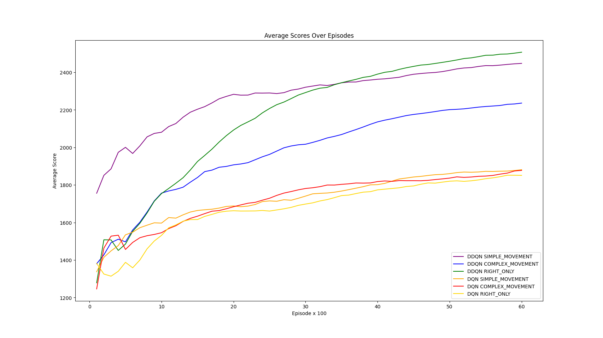
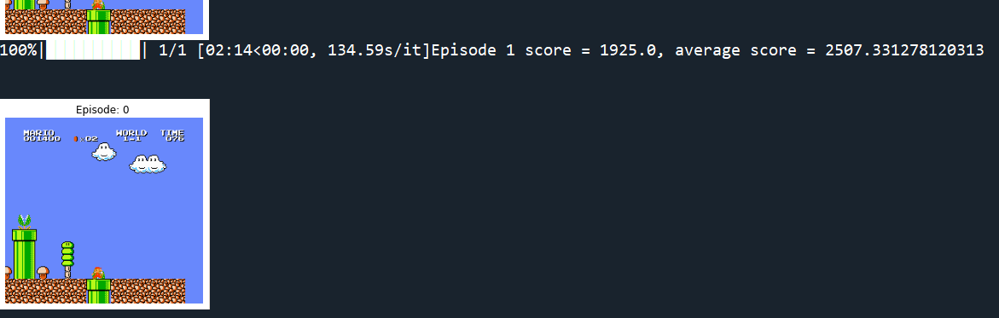

# Overview
The code is intended for training and testing an agent's performance in the "Super Mario Bros 2" game environment using Deep Q-Networks (DQNs) and Double-DQN (DDQN). It employs the Gym and gym_super_mario_bros libraries to interact with the environment. The goal is to create an AI agent capable of playing the game effectively. 

**This code has been configured to run on the Spyder(Anaconda3) IDE because it uses a magic function (matplotlib inline - in lines 15 and 25). Changes are necessary to make it run on a different IDE.**

The code starts by importing necessary libraries and setting up the environment for the "Super Mario Bros" game. It also configures GPU usage if available. The main components of the code include defining the DQNAgent class, which implements the DQN and DDQN algorithms, and creating various wrappers to preprocess the game frames. The DQNAgent class encapsulates the DQN algorithm's key functionalities. It includes methods for storing experiences, randomly sampling batches for experience replay, selecting actions based on an epsilon-greedy policy, performing experience replay updates, and copying network weights for Double DQN.

The MaxAndSkipEnv class is a wrapper that repeats an action over multiple frames to account for the skipping nature of the environment's observation. This helps the agent capture more information from consecutive frames.
The MarioRescale84x84 class resizes and preprocesses the frames to grayscale images with dimensions 84x84. This resizing reduces the computational complexity while retaining important visual information.
The ImageToPyTorch class converts the frame data into PyTorch tensors. This conversion facilitates compatibility with neural networks.
The BufferWrapper class manages experience replay. It stores past states, actions, rewards, next states, and done flags, facilitating the training process.
The PixelNormalization class further normalizes pixel values to the range [0, 1] to improve training convergence.
The create_mario_env function combines these wrappers and configurations to create the final environment for the agent. It wraps the environment to ensure it's compatible with the DQN algorithm.

The DQNSolver class implements the neural network architecture for the DQN algorithm. It consists of convolutional layers followed by fully connected layers. The number of convolutional layers and neurons can be adjusted as needed.

The run function is responsible for training or testing the agent. In training mode, it iterates through episodes, playing the game and updating the agent's Q-values using experience replay and the DQN algorithm. In testing mode, the agent plays the game using a learned policy. The code provides options for both training and testing modes, as well as the choice between DQN and Double DQN approaches. Pretrained models can also be used for testing or continued training. The total_rewards list tracks the rewards earned in each episode, aiding in monitoring the agent's performance.

Overall, the code outlines a comprehensive pipeline for training an AI agent to play "Super Mario Bros" using DQN-based reinforcement learning techniques. It incorporates various preprocessing steps and utilizes experience replay for stable and effective learning. It also facilitates saving and loading the agent's progress for continued training or testing. This code has been produced by referencing [this blog](https://blog.paperspace.com/building-double-deep-q-network-super-mario-bros/)

To train a model simply comment line 416 and uncomment line 413. In order to implement DDQN instead of DQN, simply change the value of the variable double_dqn as True. For testing comment line 413 and uncomment line 416. Extra instuctions are available in the readme.txt file. Movement strategies for the agent can be configured based on gym_super_mario_bros.actions on line 142.

The code can hence train 6 different agents based on 2 algorithms (DQN and DDQN) and 3 movement strategies (SIMPLE_MOVEMENT, COMPLEX_MOVEMENT, RIGHT_ONLY). The training results for 6000 epochs are as shown below.

Sample testing results are as shown below:

